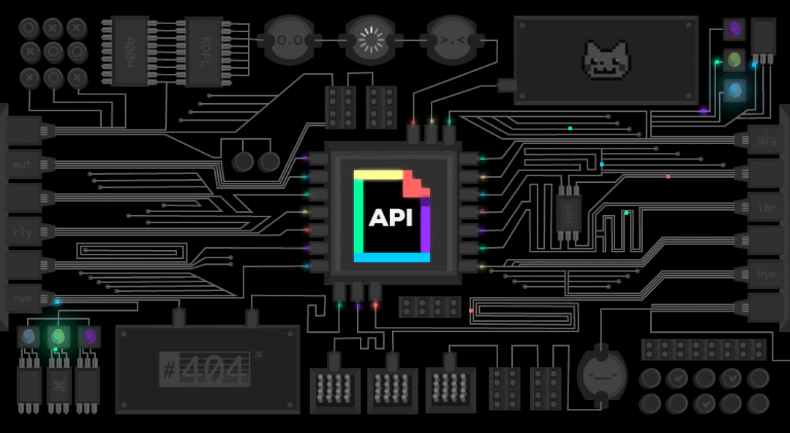

<!--  -->

<!-- 

 -->

<!--  -->

<!--  -->

<!-- 
 -->

]

---

### 🙋🏻 About Me

- Hi I'm Sungbin Yang(Robert).
- I am a back-end developer.
- Mainly using java, kotlin

### 💡 Work Experience

- **SelectStar** - Backend Engineer _(AUGUST 2025 ~ PRESENT)_
- **Trigitsoftware** - Software Development Engineer _(Nov 2020 ~ JUL 2025)_

### 📋 Contents - Individual

- [YOUTHCON'25 연사](https://frost-witch-afb.notion.site/YOUTHCON-25-2d1ff80c22ae81afbfbfc1b3f3b2bb18)
- [2025년 1분기 회고(feat. 중요한 것은 포기하지 않는 마음)](https://sungbin.kr/중요한-것은-포기하지-않는-마음/)
- [2023 주니어 개발자 회고록](https://sungbin.kr/2023년-주니어-개발자-회고록/)
- [라떼 개발자](https://sungbin.kr/라떼-개발자/)
- [2024 주니어 개발자 회고록](https://sungbin.kr/2024년-주니어-개발자-회고록/)

### :octocat: Contributions
- **spring-projects/spring-framework**
  - [PR](https://github.com/spring-projects/spring-framework/pull/33612)
    - Refactor unwrapOptional method to improve readability and performance
  - [PR](https://github.com/spring-projects/spring-framework/pull/33646)
    - Refactor Replace hardcoded path separator with PATH_SEPARATOR constant
